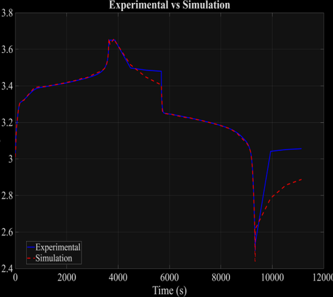
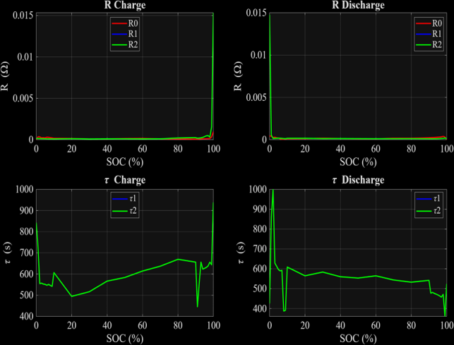

# Parameterization

Fits the 2-RC ECM parameters (R0, R1, R2, τ1, τ2) for charge and discharge against beginning-of-life experimental data using Simulink Design Optimization (SDO).

## Files

| File | Role |
|------|------|
| `parameters.m` | Configure simulation temperature, load experimental signals, set initial guesses and optimizer bounds |
| `BOL_data.csv` | Extracted BOL experimental data: `time_s`, `current_A`, `voltage_V` |
| `BatteryParameterization.slx` | Simulink model — runs SDO optimization to fit the 10 RC parameters against `BOL_data.csv` |
| `RC_values_plot.m` | Loads fitted RC parameters from an SDO session and plots R0, R1, R2, τ1, τ2 vs SOC (charge & discharge) |

### Result directory: `1C-CCCV-25/`

| File | Contents |
|------|----------|
| `ECMParams.mat` | Fitted RC parameters from the SDO session at 25 °C |
| `fitting_results.png` | Simulated vs experimental voltage curve |
| `RC_params.png` | Fitted R0, R1, R2, τ1, τ2 vs SOC |
| `voltage_error_results.mat` | Saved RMSE / MAE / MAPE error metrics |

## Usage

**Step 1 — Configure `parameters.m`**

Open `parameters.m` and set:

```matlab
T_sim = 25;   % Simulation temperature (°C)
```

This controls which OCV curve is used (interpolated between available temperature data). All other settings (voltage limits, SOC grid, optimizer bounds) can be left at their defaults.

**Step 2 — Run `parameters.m`**

```matlab
run('parameters.m')
```

This loads the workspace variables required by `BatteryParameterization.slx`:
- `t_exp`, `i_exp`, `v_exp` — experimental time, current, voltage signals
- `OCVs`, `SOCs` — OCV lookup table at `T_sim`
- Initial guesses: `R0_charge`, `R1_charge`, `R2_charge`, `tau1_charge`, `tau2_charge` (and discharge variants)
- Bounds: `lb_R`, `ub_R`, `lb_tau`, `ub_tau`

**Step 3 — Open and run `BatteryParameterization.slx`**

Open the model in Simulink, then in the **SDO** tab click **Optimize**. The optimizer fits all 10 parameters (5 × charge + 5 × discharge) to minimise voltage error against the experimental signal. Save the SDO session as `ECMParams.mat` into the appropriate result directory (e.g. `1C-CCCV-25/`).

**Step 4 — Visualise fitted RC parameters**

```matlab
RC_values_plot    % plots R0, R1, R2, τ1, τ2 vs SOC for charge and discharge
```

## Optimizer Bounds

| Parameter | Lower | Upper |
|-----------|-------|-------|
| R0, R1, R2 | 1×10⁻⁵ Ω | 10 Ω |
| τ1, τ2 | 0.1 s | 1000 s |

## **Results**

### Example 1C charge - 1C discharge curve



### Example 1C charge - 1C discharge curve RC values



