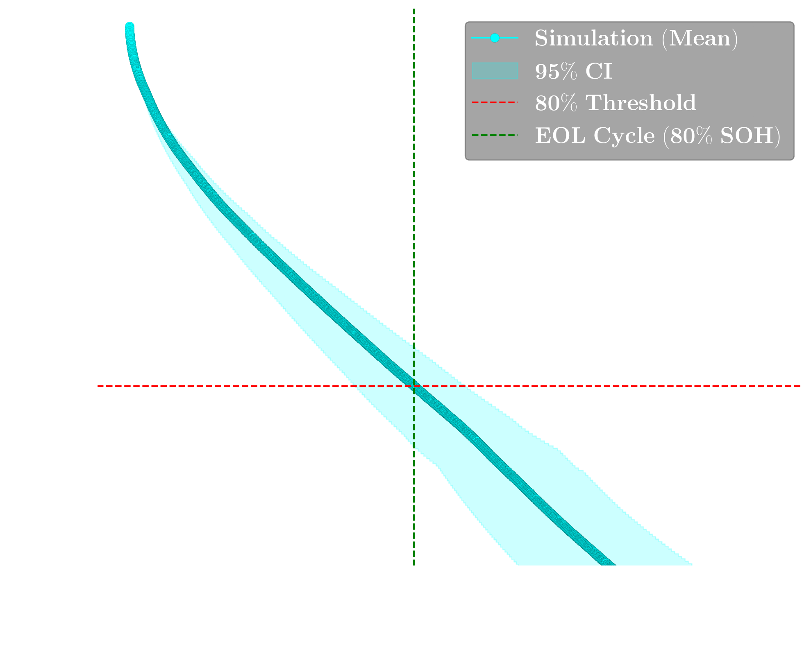

# Battery Model based on Equivalent Circuit Model (ECM)

Physics-based RC equivalent circuit model (ECM) for predicting cycle and calendar ageing of lithium ion batteries. Implements a 2-RC-branch ECM with Monte Carlo uncertainty quantification.

## Repository Structure

```
Modeling/
├── BOL_parameterization/   # Step 1 — Fit RC parameters against BOL data
│   ├── parameters.m
│   ├── BOL_data.csv
│   ├── BatteryParameterization.slx
│   ├── RC_values_plot.m
│   └── 1C-CCCV-25/        # Fitted results: ECMParams.mat, RC_params.png
│
├── CycleLifePrediction/    # Step 2a — Predict capacity fade over cycling
│   ├── config.m
│   ├── CycleAgeingParams.mat
│   ├── CyclingAgeing.slx
│   ├── run_single_simulation.m
│   ├── run_mc_simulation.m
│   ├── 1C-CCCV-25-SOC0_100/ 
│   └── results.ipynb
│
└── CalendarAgeing/         # Step 2b — Predict capacity fade during storage
    ├── config.m
    ├── CalendarAgeingParams.mat
    ├── CalendarAgeing.slx
    ├── run_single_simulation.m
    ├── run_mc_simulation.m
    ├── 100%SOC_25degC/     # Example results directory
    └── results.ipynb
```

## Workflow

The three modules run in dependency order:

```
BOL_parameterization
    |── ECMParams.mat  ──────────────────────────────────┐
    ↓                                                    ↓
CycleLifePrediction                          
    └── CycleAgeingParams.mat ──────────────────────────→ CalendarAgeing
```

### Step 1 — BOL RC Parameterization

Fit R0, R1, R2, τ1, τ2 (charge & discharge) against beginning-of-life experimental data using Simulink Design Optimization (SDO). See [`BOL_parameterization/README.md`](BOL_parameterization/README.md).

```matlab
cd BOL_parameterization
run('parameters.m')             % Load experimental data and set optimizer bounds
% Open BatteryParameterization.slx → SDO tab → Optimize
% Save session as 1C-CCCV-25/ECMParams.mat
RC_values_plot                  % Visualise fitted R0, R1, R2, τ1, τ2 vs SOC
```

#### **Example**

Protocol
```
1C CC charge until 3.65V;
1C CC discharge until 2.5V;
@ 25 degree C
```
*1. Fitting curve*


*2. RC-SOC values*


### Step 2a — Cycle Life Prediction

Simulate capacity fade over hundreds of cycles using the fitted RC parameters. Supports a single deterministic run or a full 20-sample Monte Carlo pipeline. See [`CycleLifePrediction/README.md`](CycleLifePrediction/README.md).

```matlab
cd CycleLifePrediction
run_single_simulation           % Single run with nominal ageing parameters
run_mc_simulation               % 20-sample parallel MC, saves results + CI curves
```

#### **Example**

*$ 1C/1C\ cycle\ @\ 25\degree C$*



### Step 2b — Calendar (Storage) Ageing

Simulate capacity fade during storage at constant SOC and temperature. **Requires `CycleAgeingParams.mat` from `CycleLifePrediction/`** — `CalendarAgeing/config.m` loads cycle ageing coefficients directly from `../CycleLifePrediction/CycleAgeingParams.mat`. See [`CalendarAgeing/README.md`](CalendarAgeing/README.md).

```matlab
cd CalendarAgeing
run_single_simulation           % Single run over num_steps storage periods
run_mc_simulation               % 25-sample parallel MC over 14 ageing parameters
```

#### **Example**

*$ 100\%SOC\ @\ 25\degree C$*


## Parameter Dependencies

| Parameter file | Produced by | Consumed by |
|----------------|-------------|-------------|
| `BOL_parameterization/1C-CCCV-25/ECMParams.mat` | `BatteryParameterization.slx` SDO run | `CycleLifePrediction/config.m`, `CalendarAgeing/config.m` |
| `CycleLifePrediction/CycleAgeingParams.mat` | Manually fitted / optimised | `CycleLifePrediction/config.m`, `CalendarAgeing/config.m` |
| `CalendarAgeing/CalendarAgeingParams.mat` | Manually fitted / optimised | `CalendarAgeing/config.m` |
| `OCV/ocv_config.m` | Experimental OCV data | `CycleLifePrediction/config.m`, `CalendarAgeing/config.m` |

## Requirements

- MATLAB R2021b or later
- Simulink
- Simulink Design Optimization (Step 1 only)
- Parallel Computing Toolbox (`run_mc_simulation.m`)

The parallel temp directory is set at the top of each `run_mc_simulation.m`:
```matlab
setenv('TMP', 'D:\MATLAB\temp');   % update this path for your machine
```
